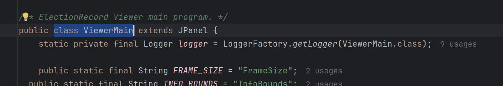
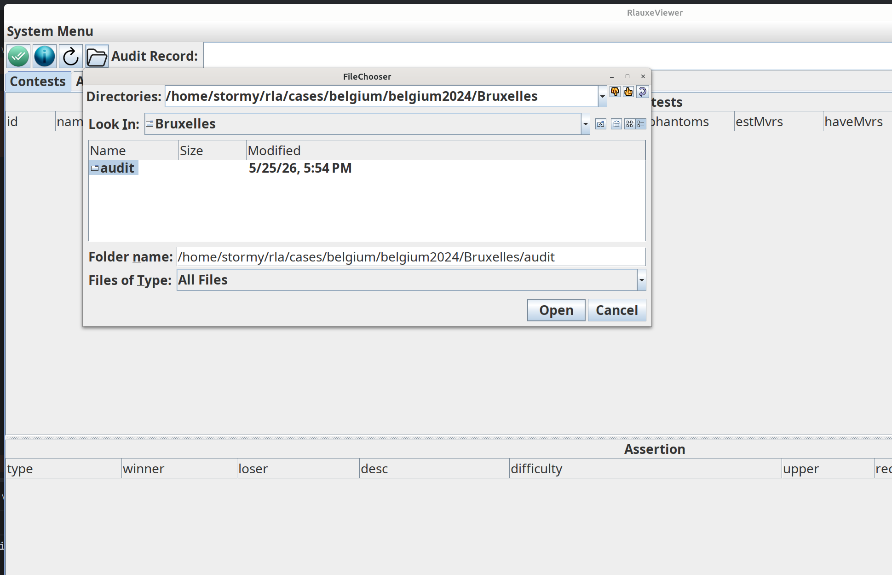
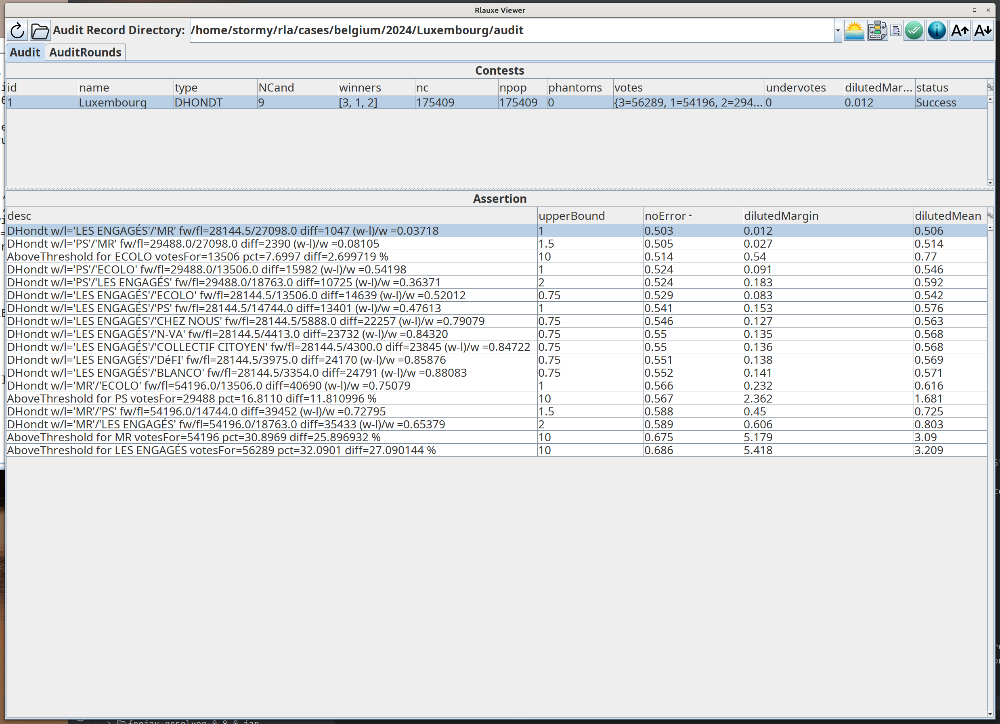
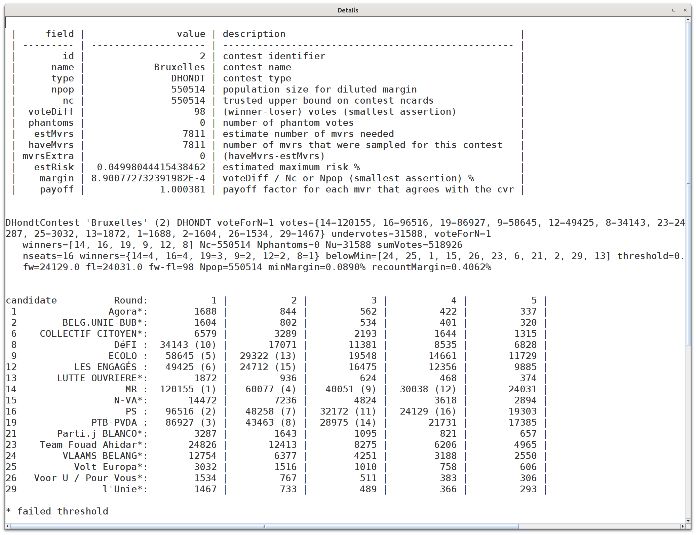
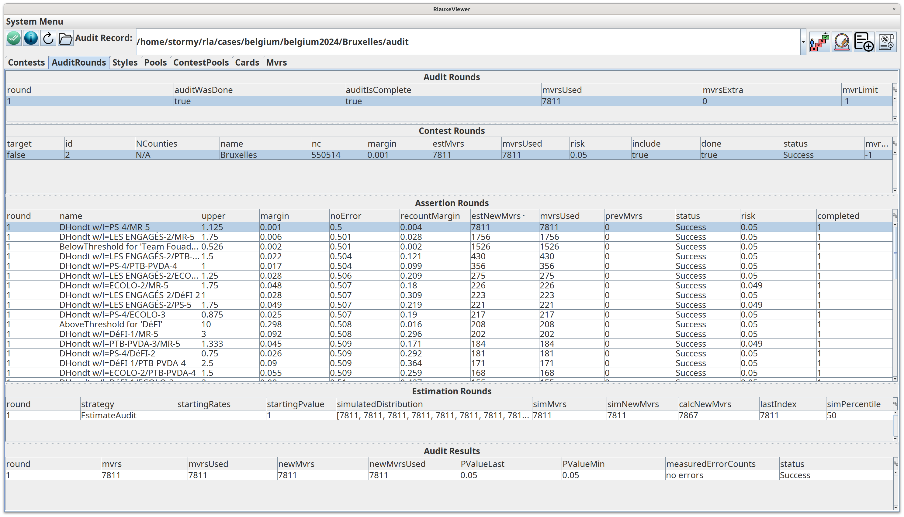
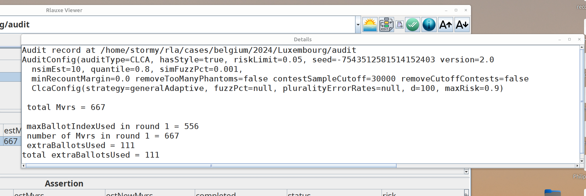
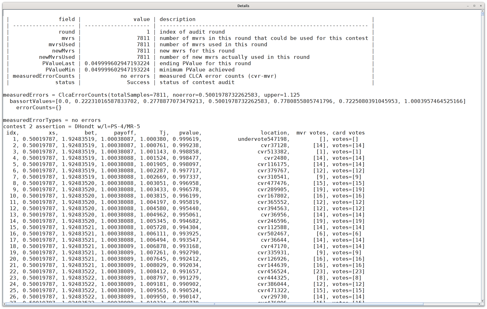

# rlauxe-viewer

WORK IN PROGRESS
_last update: 05/22/2026_

<!-- TOC -->
* [rlauxe-viewer](#rlauxe-viewer)
  * [Building Rlauxe-viewer](#building-rlauxe-viewer)
  * [Audit Case Study Data](#audit-case-study-data)
  * [Starting Rlauxe-viewer](#starting-rlauxe-viewer)
    * [Setting UI choices](#setting-ui-choices)
  * [Showing the results of an audit](#showing-the-results-of-an-audit)
  * [Special Features for Belgium Audits](#special-features-for-belgium-audits)
  * [Special Features for Corla Audits](#special-features-for-corla-audits)
<!-- TOC -->

## Building Rlauxe-viewer

Download the repo:
````
cd <devhome>
git clone https://github.com/JohnLCaron/rlauxe-viewer.git
````

Build the application:
````
cd rlauxe-viewer
./gradlew clean assemble uberJar
````

## Audit Case Study Data

[The Rlauxe getting started page](https://github.com/JohnLCaron/rlauxe/blob/main/docs/Developer.md#getting-started) has instructions
on how to build all of the case study datasets.

Contact me for the prebuilt Belgium 2024 dataset. This will be a zip file that you can unzip in your data directory.


## Starting Rlauxe-viewer

`cd devhome/rlauxe-viewer
`
(for Belgium Chamber of Representatives audits with D'Hondt scoring):

`java -jar viewer/build/libs/viewer-uber.jar -belgiumAudit
`
(for Colorado Statewide audits with County breakout):

`java -jar viewer/build/libs/viewer-uber.jar -corlaAudit
`
(or regular audit):

`java -jar viewer/build/libs/viewer-uber.jar
`

For all of these, you can optionally set the default directory where Audit Records are kept, eg

`java -jar viewer/build/libs/viewer-uber.jar -belgiumAudit -datadir /my/rlauxe/audits
`

which is where the "Audit Record Chooser" widget will start from.

From IntelliJ:

In the Project Panel, navigate to the source file

_viewer/src/main/java/org/cryptobiotic/rlauxe/viewer/ViewerMain.java_

In the editor, there should be a clickable green button on class ViewerMain:

.

After the application starts, use the "Audit Record Chooser" button

to bring up the "Audit Record Chooser" widget,
then navigate to the directory where the Audit Record is stored 

Note that for Belgium or Corla audits, this is the top directory containing the component counties or province audits,
but for regular audits, its the subdirectory named "audit" under the test case name. (Sorry about that).



The **Audit** tab will be populated from the chosen audit record:



Select the Contest in the top table, right click and choose **Show Contest**. The Detail window shows more information about that Contest.
For Dhondt, it summarizes the scoring rounds and winning parties, as well as the parties who didnt clear the threshold (with an asterisk):



### Setting UI choices

The first time you start up, you can change the window size, the table sizes, the order and size of the table headings, etc.
When you exit, your choices will be saved  (in ~/.rlauxe/RlauxeViewer.xml) for the next time you start the application.


## Showing the results of an audit

If the audit has already run, clicking on the **AuditRounds** tab will show you the results by round:



In this case, the audit completed successfully in a single round. The **Assertion** table shows all the assertions needed by the
audit. By clicking on the **noError** header, the assertions are sorted by the assertion's noerror field.

The **EstimationRounds** table shows the estimated distribution of samples needed for the selected assertion. 
If one looks at the AuditConfig fields by clicking on the info button 
:



We see that simFuzzPct = .001, meaning that in 1 in 1000 ballots, the candidate voted for was randomly changed, to simulate errors in the CVRs.
Also, nsimEst=10, so 10 simulation were done to create the distribution.
The distribution is given in deciles, so that 10*(idx+1) percent of the distribution is less than decile[idx] (idx is zero based).

The **Audit Results** table shows what happened in the "real" audit for the selected assertion. 
In this example, our estimate was 667 samples, but only 556 were needed.

If you right click on the Audit Result line, and choose **Show Audit Details**, the detail window reruns the audit and shows the
actual audit sample values, betting value, pvalue, mvr and cvr. The fields are:

  * j  : sample number
  * xj : assort value
  * lamj : BettingMart bet
  * tj : (1 - lamj*(xj - mj) )
  * Tj : Product (tj, j=1..j)
  * pvalue = 1 / Tj
  * location: sampled CVR's location
  * mvr votes: MVR's votes
  * card: CVR's votes



In this example, the votes always match, so the assort value always equals noerror, and the estimate should be spot on.

## Special Features for Belgium Audits


## Special Features for Corla Audits

