# rlauxe-viewer

WORK IN PROGRESS
_last update: 05/26/2026_

<!-- TOC -->
* [rlauxe-viewer](#rlauxe-viewer)
  * [Building Rlauxe-viewer](#building-rlauxe-viewer)
  * [Audit Case Study Data](#audit-case-study-data)
  * [Starting Rlauxe-viewer](#starting-rlauxe-viewer)
    * [From the command line](#from-the-command-line)
    * [From IntelliJ:](#from-intellij)
    * [Setting UI choices](#setting-ui-choices)
  * [Showing the results of an audit](#showing-the-results-of-an-audit)
  * [Special Features for Belgium Audits](#special-features-for-belgium-audits)
    * [Choose number of mvrs](#choose-number-of-mvrs)
      * [Setting mvrLimit in the samplesLimit.txt file](#setting-mvrlimit-in-the-sampleslimittxt-file)
    * [Choose candidate coalitions](#choose-candidate-coalitions)
  * [Special Features for Corla Audits](#special-features-for-corla-audits)
<!-- TOC -->

## Building Rlauxe-viewer

Download the repo:
````
cd <devhome>
git clone https://github.com/JohnLCaron/rlauxe-viewer.git
````

Build the viewer application:

````
cd rlauxe-viewer
./gradlew clean assemble uberJar
````

and check that `viewer/build/libs/viewer-uber.jar` was built.

## Audit Case Study Data

[The Rlauxe getting started page](https://github.com/JohnLCaron/rlauxe/blob/main/docs/Developer.md#getting-started) has instructions
on how to build all of the case study datasets.

(Or contact me for the prebuilt Belgium 2024 dataset).


## Starting Rlauxe-viewer

### From the command line

`
cd devhome/rlauxe-viewer
`

For Belgium elections:

`
java -jar viewer/build/libs/viewer-uber.jar -belgiumAudit
`

For Colorado elections:

`
java -jar viewer/build/libs/viewer-uber.jar -corlaAudit
`

For all audits:

`
java -jar viewer/build/libs/viewer-uber.jar
`

For any of these, you can optionally set the default directory where Audit Records are kept, eg:

`
java -jar viewer/build/libs/viewer-uber.jar -belgiumAudit -datadir /my/rlauxe/audits
`

which is where the "Audit Record Chooser" widget will start from.

### From IntelliJ:

In the Project Panel, navigate to the source file

_viewer/src/main/java/org/cryptobiotic/rlauxe/viewer/ViewerMain.java_

In the editor, there should be a clickable green button on class ViewerMain:

.

After the application starts, use the "Audit Record Chooser" button

to bring up the "Audit Record Chooser" widget,
then navigate to the directory where the Audit Record is stored.

Note that for Belgium or Corla audits, this is the top directory containing the component counties or province audits,
but for regular audits, its the subdirectory named "audit" under the test case name. (Sorry about that).


The **Contests** tab will be populated from the chosen audit record:

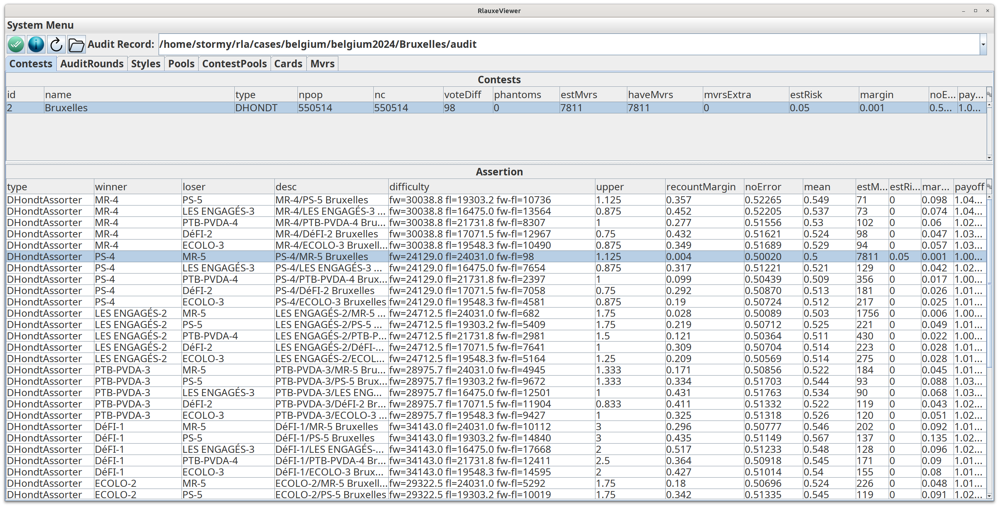

Select a Contest in the top table, right click and choose **Show Contest**. Each visible field is shown with a description
and its value for that contest, along with a summary of the contest and the reported votes for each candidate:


### Setting UI choices

Change the Font Size from the System Menu in the upper left:

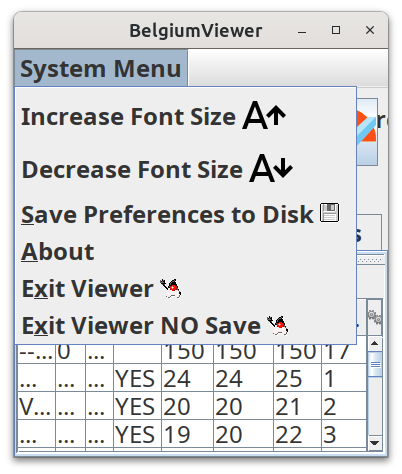

Closing the viewer window will save your UI configuration (in _~/.rlauxe/_). 
Choose "Exit Viewer NO Save" to exit without saving.
Choose "Save Preferences to Disk" to save without exiting.

The upper right corner gear widget in each table

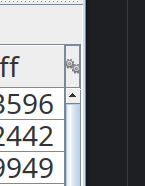.

allows you to change which columns are visible:

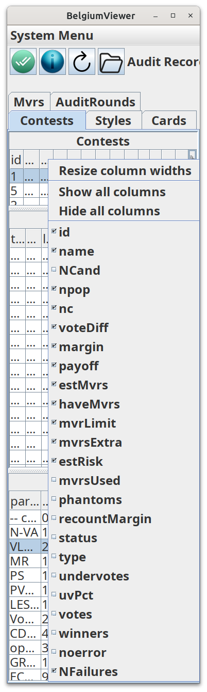.

Change the order and size of the table headings, by clicking and dragging the table headers:

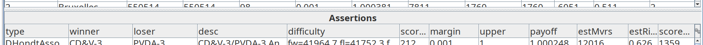.

Change the table sort order by clicking the table header of the field you want to sort on. 


## Showing the results of an audit

If the audit has already run, clicking on the **AuditRounds** tab will show you the results by round:


In this case, the audit completed successfully in a single round. The **Assertion Rounds** table shows all the assertions needed by the
audit. By clicking on a header, you can sort the table by that column's value. In this example, we have sorted on the "estimate new Mvrs" colums, to see which assertions require the most samples.

The **Estimation Rounds** table shows the estimated distribution of samples needed for the selected assertion. 
The **Audit Results** table shows the results of the actual Audit (if its was done).

If you right click on the Audit Result line, and choose **Rerun audit with Details**, the audit is rerun and shows the
actual audit sample values, betting value, pvalue, mvr and cvr. 


In this example, the votes always match, so the assort value always equals noerror, and the estimate should be spot on.
The fields shown in the **Rerun audit with Details** report are:

* j  : sample number
* xj : assort value
* lamj : BettingMart bet
* tj : (1 - lamj*(xj - mj) )
* Tj : Product (tj, j=1..j)
* pvalue = 1 / Tj
* location: sampled CVR's location
* mvr votes: MVR's votes
* card: CVR's votes


## Special Features for Belgium Audits

To bring up the specialized Belgium Audit viewer, add -belgiumAudit to the command line, for example:

`java -jar viewer/build/libs/viewer-uber.jar -belgiumAudit`

Use the Audit Record chooser to navigate to the top of the Belgium Audit Record, and select it.

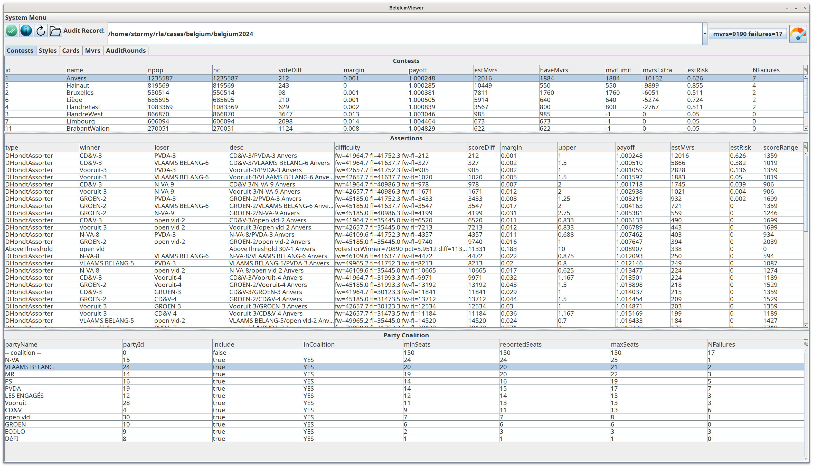

The first table shows all the contests, ie the electoral districts. Choosing a contest shows its assertions in the second table. 
The total seats for each party (aka candidate) across all contests are shown in the third table.

### Limiting the number mvrs sampled

In the assertion table, the _estMvrs_ column shows how many mvrs will be needed to satisfy the risk limit for that assertion,
when no discrepancies between the mvrs and the cvrs are found.

The same field in the contest table shows the maximum needed over all assertions for that contest. The contest _mvrLimit_ allows you
to limit the number of mvrs for that electoral district. Click in the cell, and enter the mvr limit for that contest.
The value of -1 means no limit, so the audit will use the value of estMvrs.

If mvrLimit is less than estMvrs, some of the assertions will fail, meaning that the risk will be above the risk limit (in this example 5%).
You can see this in the _estRisk_ field of the assertion table.

The game is to try to minimize the number of mvrs and minimize the number of failing assertions.

The status button in the upper right displays the total mvrs and the number of failed assertions over all contests.


#### Setting mvrLimit in the samplesLimit.txt file

In the top directory, there may be a samplesLimit.txt file:

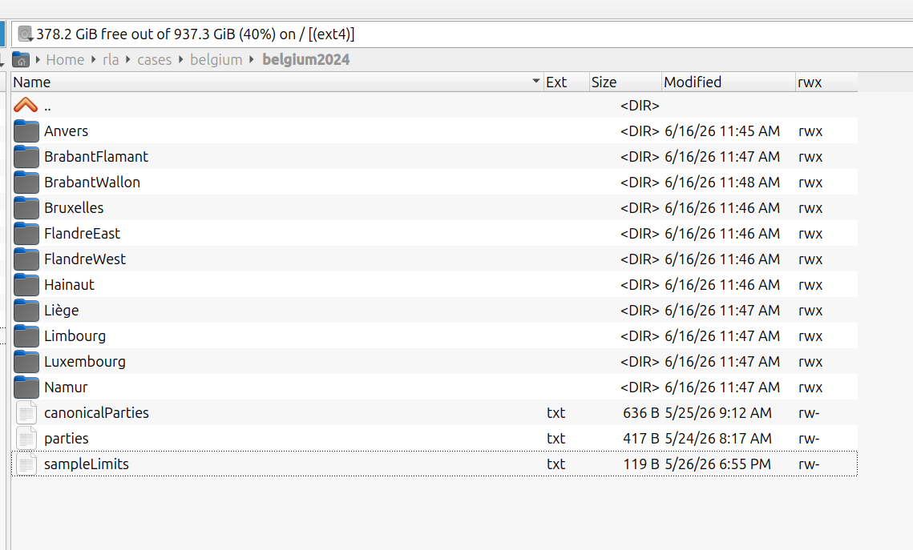

In this example, that file has the following content:


````
contest name, contest id, mvrLimit
Anvers, 1, 1884
Bruxelles, 2, 1760
FlandreEast, 4, 800
Hainut, 5, 550
Liege, 6, 640
````

And you can see that these values are used as the defaults for _mvrLimit_ in the Contests table of the BelgianViewr.
If a contest is not listed, then mvrLimit is not set.

This file is read in and used if present upon startup. You may edit this file by hand, and then use the **reread sample limits** button
in the upper right to reread it. After reading it in, you may modify the mvrLimits by hand. These changes are not
written back to the samplesLimit file.

### Choose Party coalitions

In the Party Coalition table, each party is shown with the reported number of seats won over all contests, along with 
the number of failed assertions that affect that party (if all contests draw _estMvrs_ samples there will be no failures). 

When there are failures, the _minSeats_ / _maxSeats_ columns show the minimum/maximum number of seats the party won if 
all _disputed assertions_ are flipped against it / in favor of it.

You can choose party coalitions by clicking on the _include_ column of the party. The number of min/reported/max seats is 
shown for that coalition of parties. This is not the sum over parties of those fields, because if a disputed assertion has both its
winner and loser in the coalition, than the number of seats for the coalition is not affected by the dispute.

### Party min/max seat algorithm

The algorithm for computing the _minSeats_ / _maxSeats_ for a party and a coalition is still being investigated. See [D'Hondt coalition min/max calculation](https://github.com/JohnLCaron/rlauxe/blob/main/docs/Dhondt.md) for the current algorithm used in rlauxe. The following examples may
vary in some details from the latest versions.

### Show Contest with disputed assertions

Select a Contest in the top table, right click and choose **Show Contest**. In addition to the first two sections shown for Contests of all types,
in section three DHondt contests show the scoring rounds and winning parties, as well as the parties who didnt clear the threshold (with an asterisk).
In section four the reported winners (plus first 3 losers) are shown sorted by their score = total votes / round 
(the scoreDiff column is the difference of each row's score with the row above): 

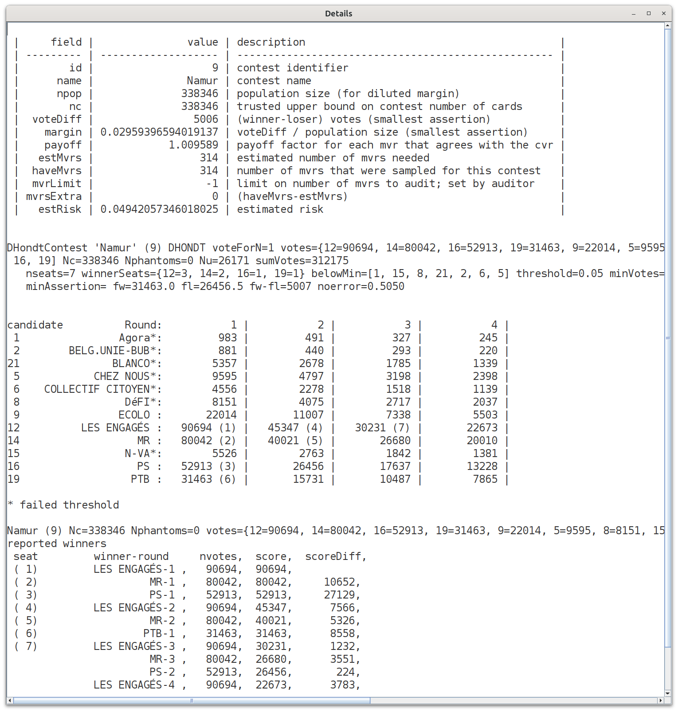

When there are disputed (aka failed assertions) there is a fifth section showing all disputed assertions for that contest:

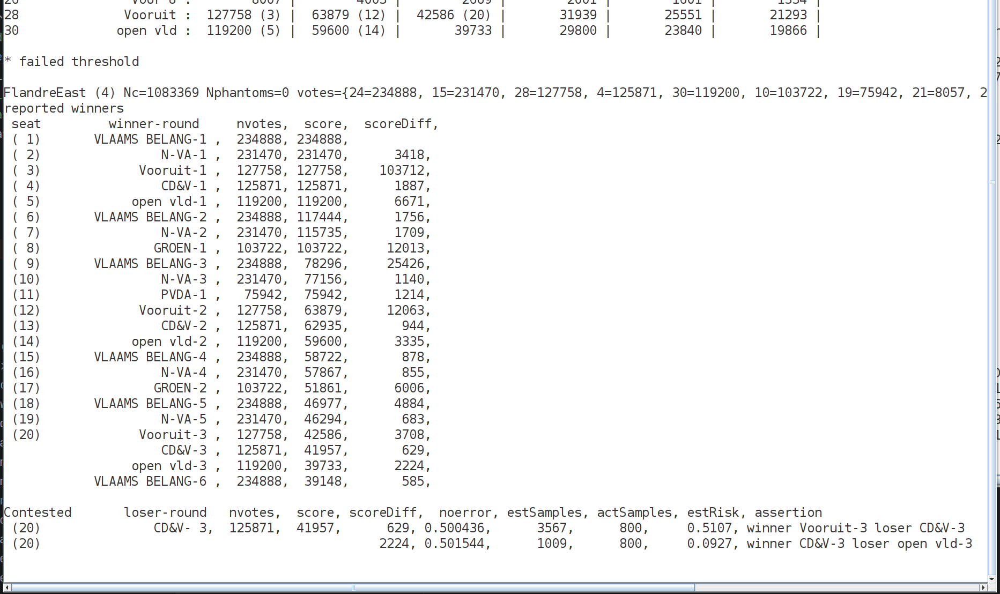

This will be explained below.

### Show disputed Assertions

In this example we have selected FlandreEast, and its assertions are shown in the Assertions table, which we reverse sort on the
_estMvrs_ field (estimated number of mvrs needed):

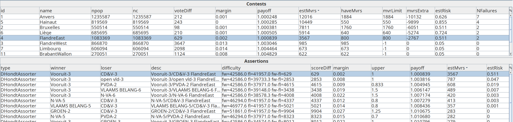

The corresponding _estRisk_ (estimated risk) field shows that the first assertion is estimated to miss the 5% risk limit.
(We chose the mvrLimit to satisfy as many assertions as possible, but this assertion was deemed too costly).

Select that assertion, right click and choose **Show Assertion**. The detail window shows:

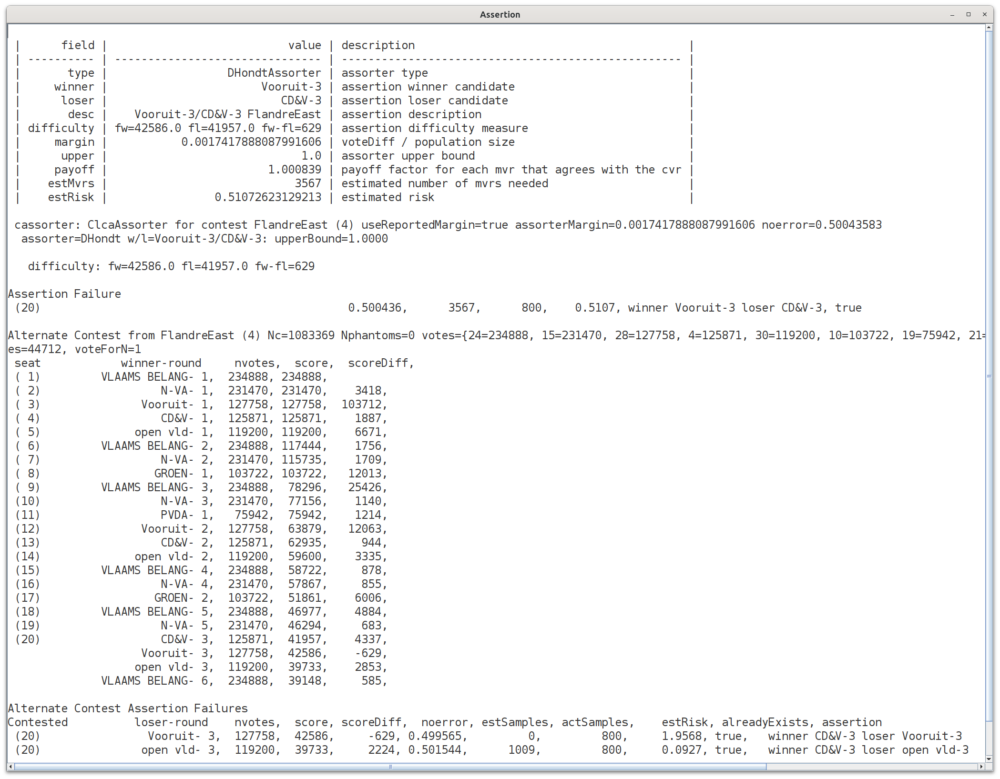

The selected assertion is "winner=Vooruit-3 loser=CD&V-3". Since this is disputed, the alternate (or flipped) assertion is "winner=CD&V-3 loser=Vooruit-3".

The section "Alternate Contest from FlandreEast" shows what the scoring looks like using the flipped assertion. Compare this to the reported scoring in the "Show Contest" for FlandreEast, where Vooruit-3  wins the last seat and CDV-3 is the first loser. Now CDV-3 wins the last seat and Vooruit-3 is the first loser. 

The alternate contest generates all the assertions needed under this alternate scoring. We show only the ones that will fail (because of mvrLimit), namely
the flipped assertion (winner=CD&V-3 loser=Vooruit-3), and also the "winner=CD&V-3 loser=open vld-3" assertion. This second assertion is
not present in the original contests since both CD&V-3 and open vld-3 are losers. 

Not shown in the output, but we compute an alternate contest for this second new assertion, and see if it has failures that we dont already have in the contest.
A new failure will keep recursing if it generates a different new failure. If it does generate a new failure, we show the alternate contest that generated it.
(I think we dont have any examples of that?).

In this case, no other failures are generated, and these two assertions are the only ones shown in FlandreEast "Show Contest".

When there are multiple failed assertions, say for Anvers which has 3 failed assertions, then for each failed assertion we compute the Alternate Contest 
and all the failed assertions it creates. We keep track of failed assertions for the entire contest; we stop recursing if we alredy have seen a particular failed assertion. Each of the 3 failed assertions for Anvers generates the same list of 4 failed assertions. So Anvers has 4 failed assertions altogether.

(TODO: we have not tried combinations of failed assertions to see if new failures are found).

Hainut is special in that its the only one in this example that has a Threshold assertion failure. However, the algorithm is the same: create an alternate contest
and find the failed assertions. Recurse on those to see if new failures are found.

(TODO: also not tested are combinations of multiple failed threshold assertions (in the same contest) to see if new failures are found).


