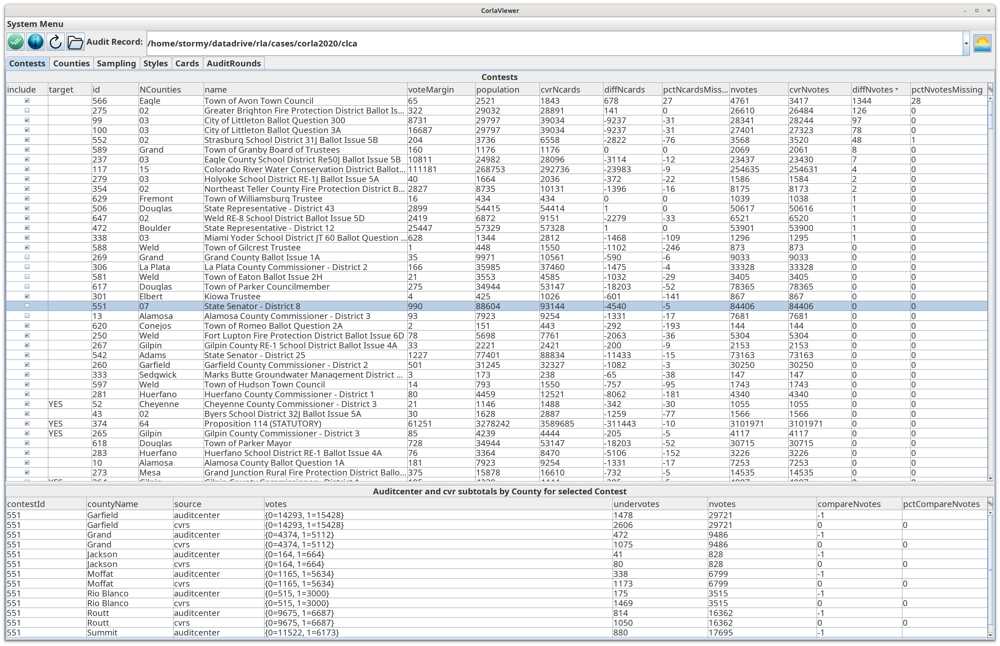
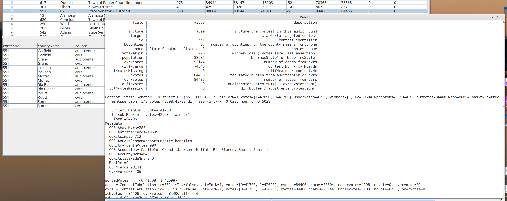
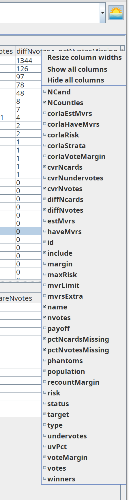

# Corla Viewer
_06/29/2026_

## Colorado auditcenter data

Neal McBurnett has done an amazing job of collecting Colorado election data since 2017 as published by 
the State of Colorado. To view it, clone his git repository:

git clone https://github.com/nealmcb/auditcenter

and follow directions in the [rlauxe library git repo](https://github.com/JohnLCaron/rlauxe/blob/main/docs/Developer.md)

## Build and Run the Viewer

First, [build the jar file](https://github.com/JohnLCaron/rlauxe-viewer#building-rlauxe-viewer) if needed:

Make sure you are in the rlauxe-viewer local git repo:

cd <devhome>/rlauxe-viewer

Then run

`java -jar viewer/build/libs/rlauxe-viewer-uber.jar -corlaAudit`

## Contests Table

The Contests table compares auditcenter information with cvrs. For example, nvotes is from the auditcenter, cvrNvotes
is from the cvrs, diffNvotes is their difference, and pctNvotesMissing is their percent differemce, with nvotes as the denominator.

Select a contest and its breakdown by county is shown in the lower table. Note that there are two rows for each COunty, one from the auditcenter and one from the cvrs.

Right-click on a contest row to see an description of each visible column aand details about the selected record.

Click on a table's top right corner gear icon  to bring up the table column chooser: 

which shows the table's columns to show or remove from the table.
