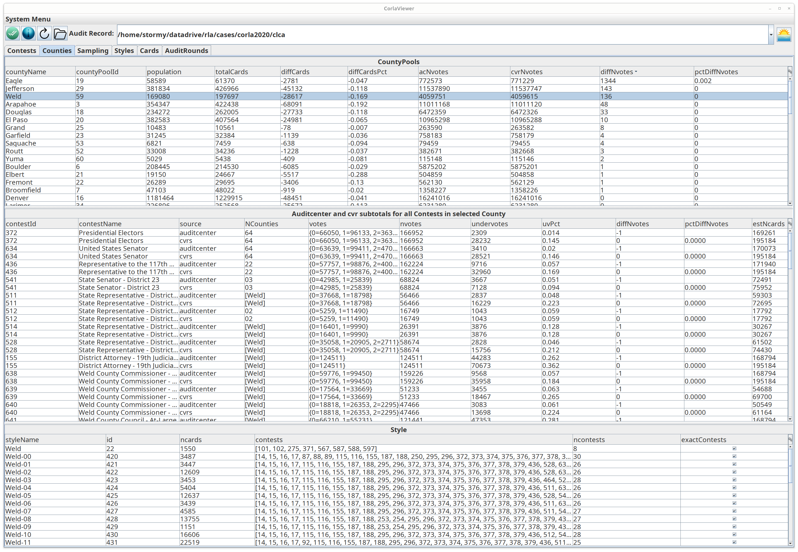
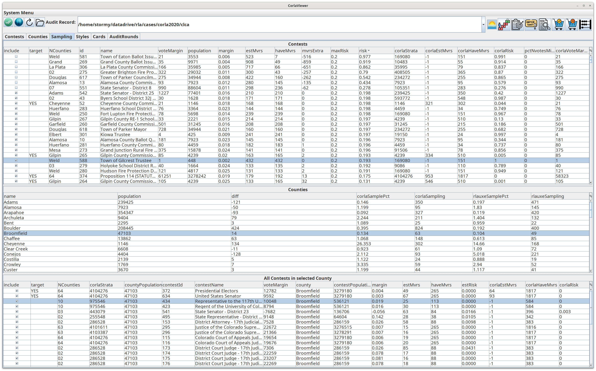
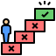
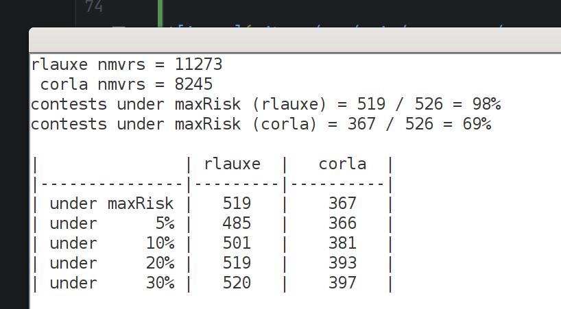
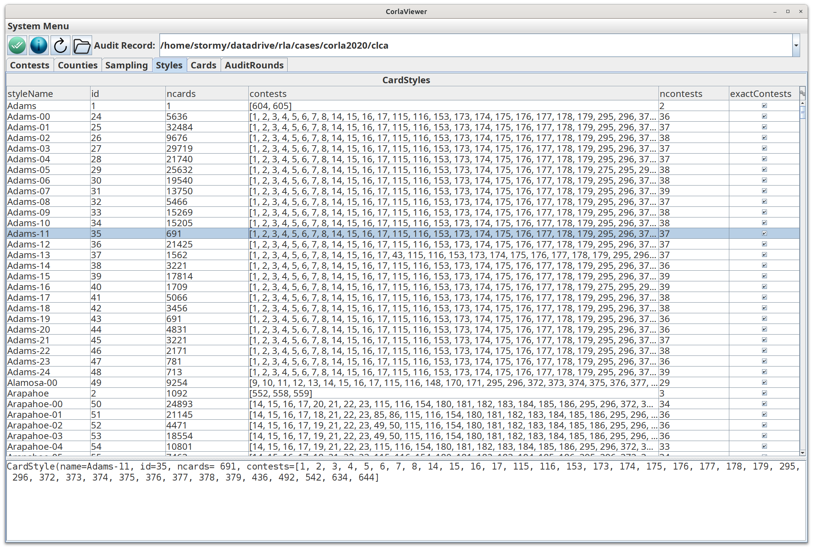
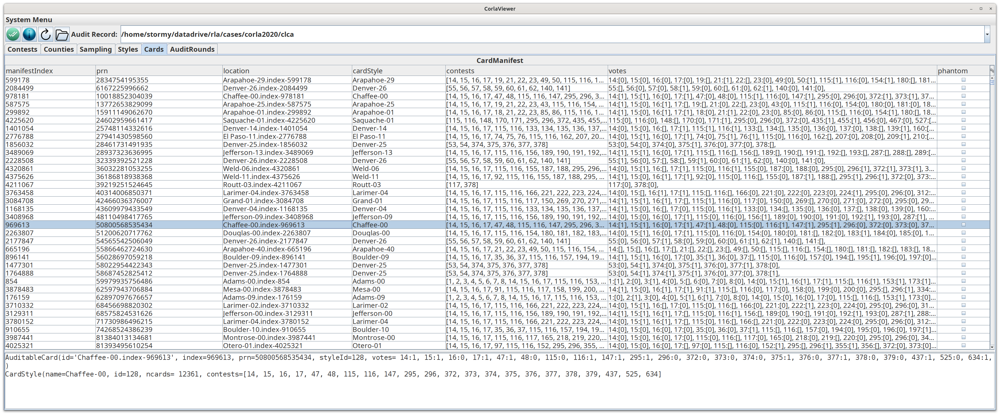

# Corla Viewer
_06/29/2026_

## Colorado auditcenter data

Neal McBurnett has done an amazing job of collecting Colorado election data since 2017 as published by 
the State of Colorado. To view it, clone his git repository:

git clone https://github.com/nealmcb/auditcenter

and follow directions in the [rlauxe library git repo](https://github.com/JohnLCaron/rlauxe/blob/main/docs/Developer.md)

## Build and Run the Viewer

First, [build the jar file](https://github.com/JohnLCaron/rlauxe-viewer#building-rlauxe-viewer) if needed:

Make sure you are in the rlauxe-viewer local git repo:

`cd <devhome>/rlauxe-viewer`

Then run

`java -jar viewer/build/libs/rlauxe-viewer-uber.jar -corlaAudit`

## Contests Table

The Contests table compares auditcenter information with cvrs by Contest. For example, nvotes is from the auditcenter, cvrNvotes
is from the cvrs, diffNvotes is their difference, and pctNvotesMissing is their percent difference (with nvotes as the denominator).

Select a contest and its breakdown by county is shown in the lower table. Note that there are two rows for each County, one from the auditcenter and one from the cvrs.

Right-click on a contest row to see a description of each visible column and details about the selected record:

Click on a table's top right corner gear icon  to bring up the table column chooser: 

which shows the table's columns to show or remove from the table.

## Counties Table

The Counties table compares auditcenter information with cvrs by County:

Select a County, and all contests in the county are shown in the middle table. Note that there are two rows for each Contest, one from the auditcenter and one from the cvrs. 

The Styles (aka _Card Styles_ or _Ballot Styles_) that are used by the selected County 
are shown in the lower table. A Style tracks which contests are on a card. Each card has a reference to the Style it uses.

## Sampling Table

The Sampling table compares how Auditing is done in the current ColoradoRLA software to auditing with rlauxe:

The results of the official ColoradoRLA audit are in the fields that start with _corla_. Corla decides on a _target_ contest in each county, which determines how many cards will be sampled in each county. Other contests that are not targeted are _opportunistically audited_; the _corlaRisk_ is our estimate of what risk level was achieved for both targeted and non-targeted contests.

Simulated results using rlauxe for the audit are seen in the other fields. Typically, rlauxe uses style-based (CSD) sampling
where the contests to be audited are specifically chosen. These are indicated by the _include_ column. You may try _what if_ 
scenarios by setting different contests to be included, and running the simulation to see how many cards are needed, and what risk levels are achieved. Rlauxe style based sampling uses a _consistent sampling_ across all counties, and is not tied to selecting single county contests to target.

When the simulation is run, the results are put into the individual contests in the top table, and aggregated by county in the middle table. If you select a County from the middle table, the results for all the contests in that county are shown in th bottom table.

### Running an rlauxe simulated audit

In the top right are various buttons that make it easy to try different scenarios of including contests:

 A toggle to only show contests "In Progress", ie available to audit.

 Once you have set the included flags, this will run the resampling and show the results.

 Include only the targeted contests, and set all other contests to not included.

 Set all "important" contest to be included, where important means
* multicounty contests
* contestName.startsWith("Representative to the")
* contestName.startsWith("State")

 All selected contests are included. You can do multiple selection with the usual gestures, click and drap, Ctrl-Click, Shift-Click. If 0 or 1 rows are selected, then include all rows.

 All selected contests are not included. If 0 or 1 rows are selected, then set all rows to not included.

 Once you have set the included flags and resampled, show a "summary risk report":

## Styles Table

The Styles Table shows all the Card Styles used in the audit:

## Cards Table

The Cards Table shows the first 10,000 Cards Styles in the Card Manifest:

## Audit Rounds Table

The Audit Rounds Table shows all the Card Styles used in the audit:

see [Showing Audit Results](https://github.com/JohnLCaron/rlauxe-viewer/tree/main#showing-the-results-of-an-audit) for more details.